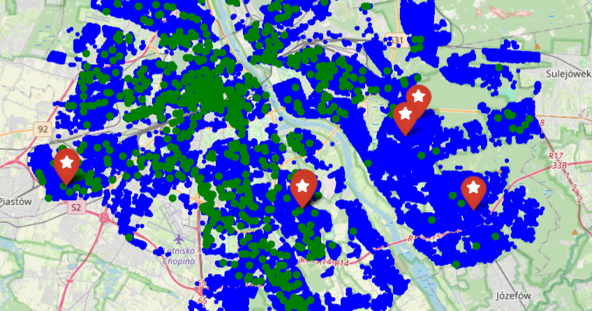

# 🏪 Smart Store Location Optimization for grocery store

**Find the best new locations for Żabka stores in Warsaw using data-driven spatial analysis and Bayesian optimization.**

---

## 🚀 Project Overview

This project uses open data and bayes optimisation to recommend optimal new locations for grocery store - specifically for Żabka, a popular Polish convenience store chain. By analyzing residential density and existing store placements, it ensures new stores are accessible to residents and not clustered too closely.

**Key Features:**
- End-to-end ETL pipeline (Bronze/Silver/Gold layers) for clean, reproducible data processing
- Spatial analysis using OpenStreetMap data
- Outlier filtering and housing density estimation
- Bayesian optimization to maximize customer reach and minimize store overlap
- Interactive map visualization with folium

---

## 📊 Data Sources

- **OpenStreetMap (OSM):** Store locations, residential buildings
- **Overpass API:** Automated spatial queries

---

## 🛠️ How It Works

1. **ETL Pipeline:**  
   - **Bronze:** Raw data ingestion from OSM  
   - **Silver:** Data cleaning, outlier removal, feature engineering  
   - **Gold:** Final aggregation and enrichment

2. **Spatial Analysis:**  
   - Convert latitude/longitude to metric coordinates  
   - Estimate residents per building

3. **Optimization:**  
   - Use Bayesian optimization to find locations maximizing customer proximity and minimizing competition

4. **Visualization:**  
   - Generate interactive maps showing housing, existing stores, and recommended new locations

---

## 🧑‍💻 Usage

```bash
python main.py
```
- Outputs recommended new store locations and saves an interactive map in `results/`.

---

## 🌟 Example Result



---

## 💡 Why Is This Cool?

- **Real-world impact:** Helps optimize retail expansion using open data and AI
- **Scalable pipeline:** Ready for any city or store chain
- **Modern stack:** ETL layers, spatial analytics, Bayesian optimization, interactive maps

---

## 📬 Contact

*Feel free to connect on [LinkedIn](https://www.linkedin.com/in/katarzyna-paczos/) or check out my [GitHub](https://github.com/KatarzynaPaczos)!*
